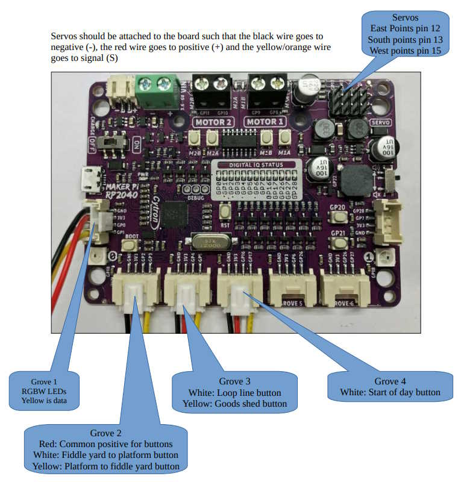

# scram
Simple Computer Railway Access Module

This is a MicroPython module to enable the setting of servo powered points, setting of RGBW LEDs on a mimic panel and push-to-make switches to select routes. The code is
primarily designed to run on a Maker Pi RP2040. The servos are connected to the servo headers on GPIO pins 12, 13 and 15. The 6 RGBW LEDs are connected to GPIO 1. The route switches are connected to GPIO 2, 3, 4, 5, 16 and 17.

The program can be made to auto-run in the normal way by renaming it to main.py.

There is audio feedback that is toggled by pressing the Start of Day button three times.

A small Easter Egg is included, a tune is triggered when the following sequence of buttons is pressed, route A twice, route B, route A twice, route B. Be aware that the program will be unresponsive until the tune has finished playing.

